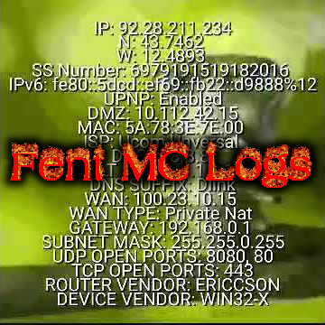

# Fent mclo.gs
**Paste, share & analyse your Minecraft logs**



## About
This is an [Aternos mclo.gs](https://github.com/aternosorg/mclogs) fork.

## Old Features
* Copy + paste log sharing
* Simple API for easy integration
* Syntax highlighting
* Line numbers
* Analysis and parsing using [codex](https://github.com/aternosorg/codex-minecraft)
* Different storage backends (mongodb, redis, filesystem)

## New Features
* Docker compose actually working
* Most things can be configured with the .env file

## Development setup
* Install Docker Compose: https://docs.docker.com/compose/install/
* Clone repository: `git clone [URL]`
* `cd mclogs/docker`
* `cp .env-example .env`
* Adjust the .env file to your needs
* `docker-compose up --build`

## Example Nginx configuration
Here are example base site and API site nginx configs:

Base site:

```
server {
    listen 80;
    server_name mclogs.mysite.com;
    return 301 https://$host$request_uri;
}

server {
    listen 443 ssl;
    server_name mclogs.mysite.com;

    ssl_certificate /etc/letsencrypt/live/mysite.com/fullchain.pem;
    ssl_certificate_key /etc/letsencrypt/live/mysite.com/privkey.pem;

    ssl_protocols TLSv1.2 TLSv1.3;
    ssl_ciphers 'ECDHE-ECDSA-AES128-GCM-SHA256:ECDHE-RSA-AES128-GCM-SHA256:ECDHE-ECDSA-AES256-GCM-SHA384:ECDHE-RSA-AES256-GCM-SHA384';

    location / {
        proxy_pass http://127.0.0.1:8082;
        include proxy_params;
        proxy_http_version 1.1;
        proxy_set_header Upgrade $http_upgrade;
        proxy_set_header Connection "upgrade";
    }
}
```

API:
```
server {
    listen 80;
    server_name api-mclogs.mysite.com;
    return 301 https://$host$request_uri;
}

server {
    listen 443 ssl;
    server_name api-mclogs.mysite.com;

    ssl_certificate /etc/letsencrypt/live/mysite.com/fullchain.pem;
    ssl_certificate_key /etc/letsencrypt/live/mysite.com/privkey.pem;

    ssl_protocols TLSv1.2 TLSv1.3;
    ssl_ciphers 'ECDHE-ECDSA-AES128-GCM-SHA256:ECDHE-RSA-AES128-GCM-SHA256:ECDHE-ECDSA-AES256-GCM-SHA384:ECDHE-RSA-AES256-GCM-SHA384';

    location / {
        proxy_pass http://127.0.0.1:8083;
        include proxy_params;
        proxy_http_version 1.1;
        proxy_set_header Upgrade $http_upgrade;
        proxy_set_header Connection "upgrade";
    }
}
```

## License
Fent mclo.gs is open source software released under the MIT license, see [license](LICENSE).
